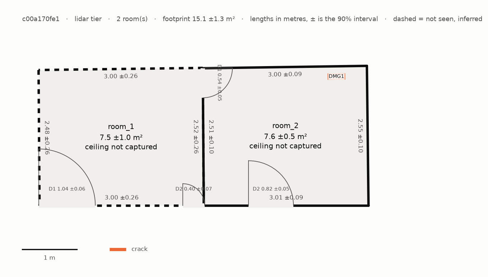
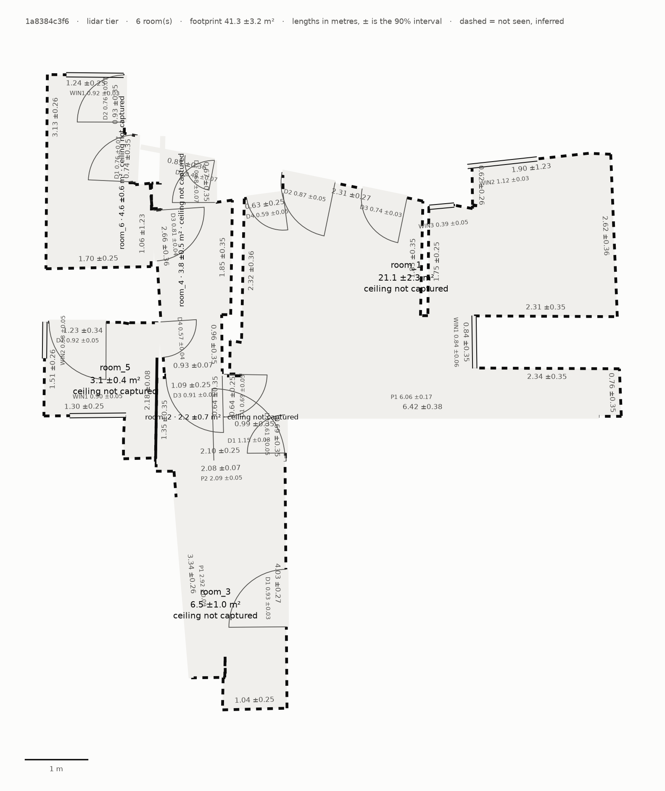
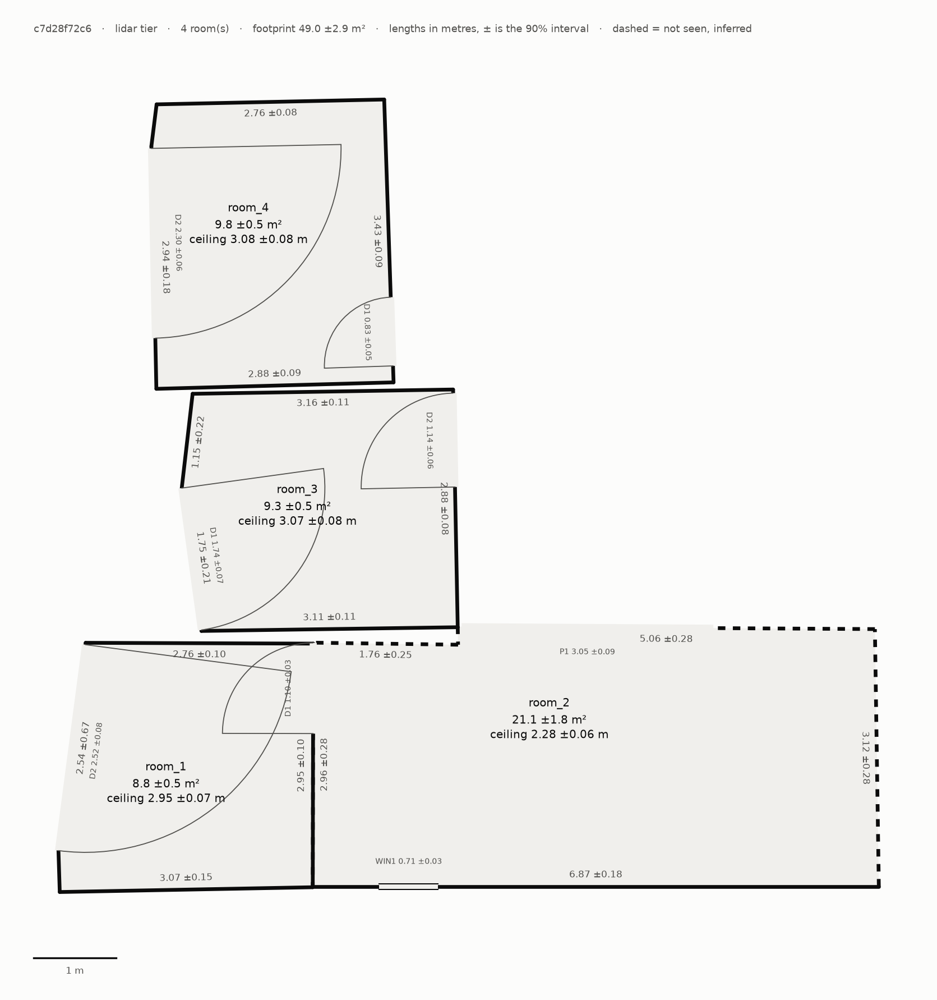

# Runs on the supplied sample data

The assessment email asked us to run the code on its sample data: three Stray Scanner
recordings made with a LiDAR iPhone. This folder holds, unedited, what one command produced
for each. **No tape or laser measurements came with the recordings**, so these runs show
whether the pipeline holds up on real iPhone captures it had never seen. They do not show how
accurate it is; accuracy against a laser is in [reports/bench/](../bench/).

## Reproduce

```
uv run python scripts/fetch_supplied.py        # 0.9 GB from the email's Drive folder, SHA-256 checked
uv run floorplan run captures/supplied/c00a170fe1 --out out/samples/single_room
uv run floorplan run captures/supplied/1a8384c3f6 --out out/samples/single_scan_floor_only
uv run floorplan run captures/supplied/c7d28f72c6 --out out/samples/single_scan_with_ceiling
```

The zips can also be given to `floorplan run` as they are. On our laptop (RTX 3050 Ti, 4 GB),
the three runs took 11 s, 58 s and 141 s (`run_log.json`, `total_s`). `plan.json` follows
[schema/plan.schema.json](../../schema/plan.schema.json), and `tests/test_schema.py` checks
these three files against it.

## The recordings

| Zip | Scan | Frames | Length | Walk | What it shows (12 evenly spaced frames) |
|---|---|---|---|---|---|
| `single_room.zip` | `c00a170fe1` | 1,715 | 37 s | 14 m | A small sitting room (television, fridge, sofa, wardrobe), the corridor outside it and a bathroom; the phone is level or aimed down, the ceiling hardly in view. [frames.jpg](single_room/frames.jpg) |
| `single_scan_floor_only.zip` | `1a8384c3f6` | 5,251 | 115 s | 54 m | A floor of a home: kitchen, bathrooms, rooms with curtains, a staircase; the phone is aimed at the floor and the foot of the walls throughout. [frames.jpg](single_scan_floor_only/frames.jpg) |
| `single_scan_with_ceiling.zip` | `c7d28f72c6` | 9,745 | 215 s | 100 m | A floor of a home, walked with the phone tilted up so that walls and ceilings are captured. [frames.jpg](single_scan_with_ceiling/frames.jpg) |

The three appear to be of the same home: the same fridge, with the same magnets, and the same
bathroom appear in all three. The pipeline does not know this, and each plan has its own
coordinate frame, so they are not compared with each other here.

## Results

Areas in m², heights in m, each with its 90% interval (± half its width). "Inferred" means
some wall bounding the room was seen over less than 30% of its length, so its position comes
from the walls around it, with a wider interval.

### single_room (`c00a170fe1`)



| Room | Floor area | Ceiling | Walls (inferred) | Openings |
|---|---|---|---|---|
| room_1 | 7.5 ± 1.0 (inferred) | not measured | 4 (4) | 3 doors |
| room_2 | 7.6 ± 0.5 | not measured | 4 (0) | 2 doors |

Footprint 15.1 ± 1.3 m². room_2 is probably the bathroom: its one damage region, a 0.30 m
"crack" by the far wall, is the edge of the shower door frame (a false positive, see
findings). A 0.55 m "window" in that wall was dropped because the detector saw a television
screen there; most likely it was the shower's dark glass, which a depth sensor also sees
through. Dropping it was right, the reason given probably not.

### single_scan_floor_only (`1a8384c3f6`)



| Room | Floor area | Ceiling | Walls (inferred) | Walls < 0.3 m | Openings |
|---|---|---|---|---|---|
| room_1 | 21.1 ± 2.3 (inferred) | not measured | 27 (24) | 8 | 4 doors, 1 passage, 3 windows |
| room_2 | 2.2 ± 0.7 (inferred) | not measured | 6 (6) | 0 | 4 doors, 1 passage |
| room_3 | 6.5 ± 1.0 (inferred) | not measured | 11 (10) | 3 | 2 doors, 2 passages |
| room_4 | 3.8 ± 0.5 (inferred) | not measured | 16 (14) | 9 | 6 doors |
| room_5 | 3.1 ± 0.4 (inferred) | not measured | 10 (7) | 2 | 2 doors, 2 windows |
| room_6 | 4.6 ± 0.6 (inferred) | not measured | 12 (12) | 6 | 3 doors, 1 window |

Footprint 41.3 ± 3.2 m². No damage regions.

### single_scan_with_ceiling (`c7d28f72c6`)



| Room | Floor area | Ceiling | Walls (inferred) | Openings |
|---|---|---|---|---|
| room_1 | 8.8 ± 0.5 | 2.95 ± 0.07 | 5 (0) | 2 doors |
| room_2 | 21.1 ± 1.8 (inferred) | **2.28 ± 0.06** | 6 (5) | 1 door, 1 passage, 1 window |
| room_3 | 9.3 ± 0.5 | 3.07 ± 0.08 | 5 (0) | 2 doors |
| room_4 | 9.8 ± 0.5 | 3.08 ± 0.08 | 5 (0) | 2 doors |

Footprint 49.0 ± 2.9 m². No damage regions.

## Findings

1. **A false ceiling, found.** room_2 of `c7d28f72c6` measures 2.28 m against 2.95-3.08 m in
   the other rooms. The frames looking up in that room ([false_ceiling.jpg](single_scan_with_ceiling/false_ceiling.jpg))
   show why: an access hatch in a lowered ceiling, and a step up to a higher ceiling at its
   edge. The room has two ceiling levels; the plan reports one height per room (the
   strongest ceiling plane), so the higher level is not reported.
2. **No ceiling, said so.** Two recordings hardly look up. Their plans report every ceiling
   height, and the height of every opening whose top was never seen, as not measured
   (`null`, with `basis: not_measured`), never a guess, and print the fix: "no ceiling
   found: tilt the phone up so the ceiling is captured".
3. **Filmed low, the outline is noisy.** In `1a8384c3f6` the walls were seen mostly at their
   foot, so most walls are inferred and the outlines are jagged (27 walls
   in room_1, 28 shorter than 0.3 m in all). The intervals widen accordingly (room_1: ±2.3
   m²). We tried straightening steps of up to 25 cm instead of 12 cm: the short walls fell
   from 28 to 15, but on the laser-measured benchmark room the area error grew from +0.38 to
   +0.57 m², so 12 cm stayed (commit `c001417`). Our capture protocol asks for the phone at
   chest height, with one slow turn tilted up to where the walls meet the ceiling.
4. **Damage detector false positives, two fixed, one left.** The rooms look undamaged. The
   detector (OWLv2, open-vocabulary, threshold 0.20) put 108 boxes on surfaces across the
   three recordings; requiring each region to be seen in two frames left two. Both were wrong
   ([damage_false_positives.jpg](damage_false_positives.jpg)):
   - a **pot plant taken for mould** on a wall (0.59 m², which raised two concealed-damage
     flags and five scope lines). Fixed: damage is part of a surface, so at least half of the
     depth points in a box must lie within 3 cm of one plane parallel to that surface. Bare
     walls and floors score 0.9-1.0 on this; the plant scored 0.06 and 0.10 (commit `7660e74`).
   - the **edge of a shower door frame taken for a 0.30 m floor crack**. It passes the
     flatness check (0.61 and 0.77: the frame stands on the floor), so it is still in the plan,
     with one scope line (crack fill, 0.30 m). Raising the score threshold would remove it
     (it scored 0.21-0.23, real damage photos score 0.34-0.83), but walkthrough frames are
     blurrier than close-up photos, and a threshold set on three undamaged homes could hide
     real damage at the walk-in test. Left as it is, and reported.
5. **Doorways filmed low were called windows.** A doorway whose top is never seen has no
   measured height, and the two sides of a doorway, merged into one opening, were classed
   by that height alone: two doorways joining rooms in `1a8384c3f6` came out as 0.6-0.9 m
   windows standing on the floor. Fixed (commit `d6c0b8f`).
6. **Very wide "doors".** In `c7d28f72c6`, three openings 1.7-2.5 m wide and 2.7-2.9 m tall
   are reported as doors (`room_1-D2`, `room_3-D1`, `room_4-D2`). At that size they are more
   likely glazed sliding doors or open bays; depth alone does not tell which.
7. **Not every room is linked.** In `c7d28f72c6` only room_1 and room_2 are joined
   (`adjacency`); the doors of room_3 and room_4 open onto space that was not reported as a
   room, so the links through it are missing.

## Limitations

- **No ground truth.** Nothing here is checked against a tape or laser. The numbers are the
  pipeline's measurements with their stated intervals, nothing more.
- **Intervals are not calibrated** for the LiDAR tier; every plan says so in its warnings.
  On the public laser-measured benchmark, 6 of 11 LiDAR intervals contained the laser's
  value: they are still too narrow.
- **One ceiling height per room**, as finding 1 shows.
- **Rooms are numbered, not named** (no "kitchen" or "bathroom").
